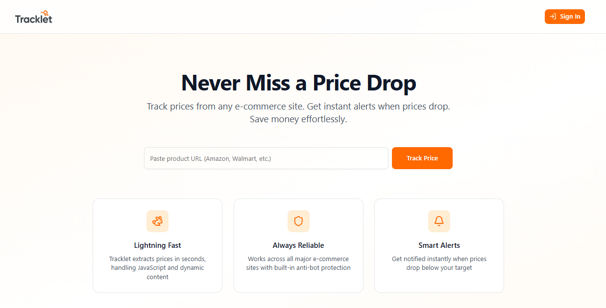
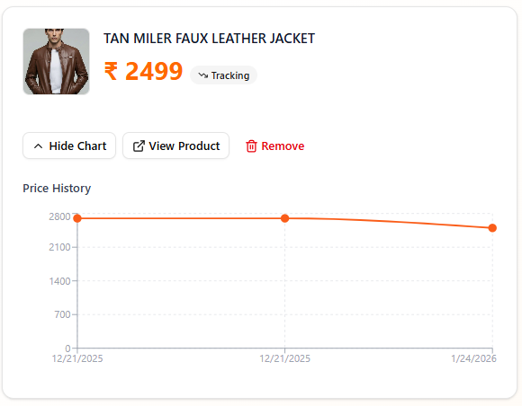
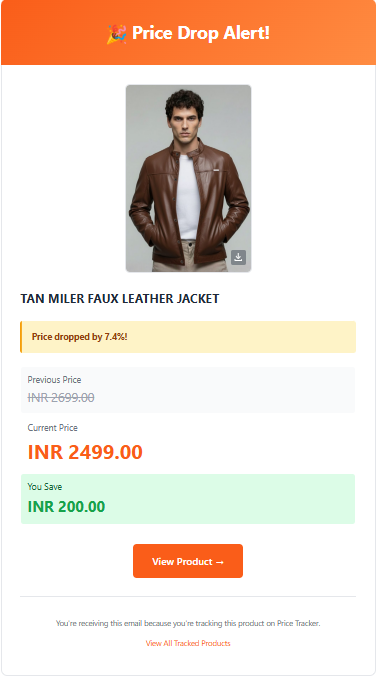

# 📉 Tracklet — Smart Product Price Tracker  

Track product prices across e-commerce platforms and get instant alerts when prices drop.  
Built with **Next.js, Firecrawl, and Supabase** to provide reliable, automated price tracking at scale.

---

## 🎯 Features

🔍 **Track Any Product**  
Works across multiple e-commerce platforms (Amazon, Flipkart, Walmart, Zara, etc.)

📊 **Price History Charts**  
Interactive charts to visualize price trends over time  

🔐 **Google Authentication**  
Secure sign-in using Google OAuth via Supabase  

🔄 **Automated Daily Price Checks**  
Scheduled cron jobs automatically check prices  

📧 **Email Alerts**  
Get notified instantly when prices drop via Resend  

🧠 **Scalable & Secure Backend**  
Row Level Security (RLS) ensures user data isolation  

---

## 🖼️ Screenshots

### 🏠 Landing Page


### 📦 Product Tracking Dashboard


### 📊 Price History Chart


### 📧 Price Drop Alert Email


> _Add screenshots inside the `screenshots/` folder._

---

## 🛠️ Tech Stack

### Framework & UI
- **Next.js 16** (App Router)
- **React**
- **Tailwind CSS**
- **shadcn/ui**
- **Recharts** (Price charts)

### Backend & Database
- **Supabase**
  - PostgreSQL
  - Google Authentication
  - Row Level Security (RLS)
  - `pg_cron` for scheduled jobs

### Web Scraping
- **Firecrawl**
  - JavaScript rendering
  - Anti-bot handling
  - Rotating proxies
  - AI-powered structured data extraction

### Email
- **Resend** (Transactional emails)

---

## 📋 Prerequisites

Before you begin, ensure you have:

- Node.js 18+
- Supabase account
- Firecrawl account
- Resend account
- Google OAuth credentials (Google Cloud Console)

---

## 🚀 Setup Instructions

### 1. Clone & Install

```bash
git clone https://github.com/your-username/tracklet.git
cd tracklet
npm install
